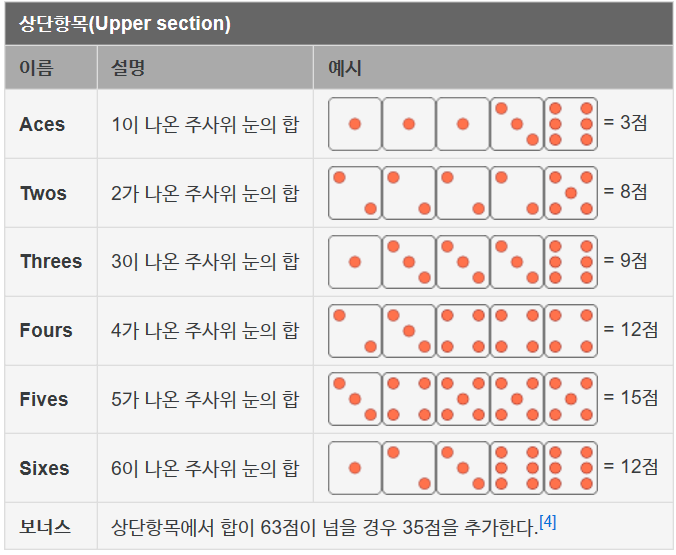

# 게임 플레이

## 방 생성

1. 방장 플레이어가 방을 생성한다.
2. 다른 플레이어들에게 입장코드를 전달한다.
3. 플레이어들이 입장한다.
4. 게임을 시작한다.

## 플레이

#### 1. 내 턴이 되어 주사위를 돌린다.(첫번째  기회)


{% column width="50%" %}
| 1번 주사위 | 2번 주사위 | 3번 주사위 | 4번 주사위 | 5번 주사위 |
| ------ | ------ | ------ | ------ | ------ |
| 3      | 1      | 3      | 4      | 6      |



{% column width="50%" %}




#### 2. 숫자 3을 남겨두고 나머지 주사위를 굴린다.(두번째 기회)



| 1번 주사위                                | 2번 주사위 | 3번 주사위                                | 4번 주사위 | 5번 주사위 |
| ------------------------------------- | ------ | ------------------------------------- | ------ | ------ |
| <mark style="color:red;">**3**</mark> | 4      | <mark style="color:red;">**3**</mark> | 2      | 5      |








#### 3. 숫자 3을 남겨두고 나머지 주사위를 굴린다.(세번째 기회)



| 1번 주사위                            | 2번 주사위                                | 3번 주사위                                | 4번 주사위                                | 5번 주사위                                |
| --------------------------------- | ------------------------------------- | ------------------------------------- | ------------------------------------- | ------------------------------------- |
| <mark style="color:red;">3</mark> | <mark style="color:red;">**1**</mark> | <mark style="color:red;">**3**</mark> | <mark style="color:red;">**1**</mark> | <mark style="color:red;">**3**</mark> |








#### 4. 점수판에 주사위 기록하기

점수 기록 방법

<figure><figcaption></figcaption></figure>

<figure><figcaption></figcaption></figure>


{% column width="66.66666666666666%" %}
'점수 기록 방법'을 보고 점수 기록하기

* 'Aces'에 2점 기록 가능
* 'Threes'에 9점 기록 가능
* 'Full House'에 25점 기록 가능

<mark style="color:red;">**⇒ 'Full House' 항목에**</mark><mark style="color:red;">**&#x20;**</mark><mark style="color:red;">**`1 1 1 3 3`**</mark><mark style="color:red;">**&#x20;**</mark><mark style="color:red;">**주사위 조합(자원)과 25점을 기록**</mark>


{% column width="33.33333333333334%" %}
<figure><figcaption></figcaption></figure>



#### 5. 자원 얻기

* 매 턴마다 점수판 항목을 채우고 점수와 자원을 얻는다.
* 주사위 조합과 항목에 따라 얻는 자원의 양은 다르다.
* 획득하는 자원의 양은 아직 기획되지 않음.

#### 6. 플레이어 이동

* 얻은 자원으로 지도 위에서 자신의 위치를 이동
* 시야거리 밖은 보이지 않는다.
* 미개척지로 이동한다면 본인의 개척지로 등록되고 점수 획득

<figure><figcaption></figcaption></figure>

#### 7. 위의 순서로 반복한다.

* 12개의 항목을 다 채운다.
* 이후 한 바퀴를 추가로 돌면서 남은 자원을 사용해서 지도 위를 이동한다.
* 한 바퀴 끝나고, 결과표가 나오고 순위가 정해진다.

